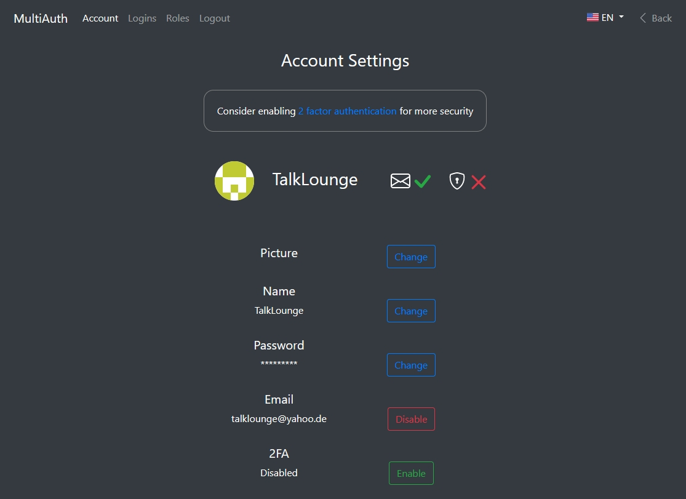

# MultiAuth Frontend
Simple Single Sign On for your website project
<br>
Have you ever been annoyed by user authentication when programming a website? Use MultiAuth
<br>
See [MultiAuth Backend](https://github.com/TalkLounge/multiauth-backend#readme) for more information
<br>
<br>


## Table of Contents
- [MultiAuth Frontend](#multiauth-frontend)
  - [Table of Contents](#table-of-contents)
  - [Features](#features)
  - [Getting Started](#getting-started)
    - [Requirements](#requirements)
    - [Installation](#installation)
    - [Development](#development)
    - [Production](#production)
  - [License](#license)

## Features
* Fast and direct SSO, no need for user interaction
* Discord like user system
    * Every user gets a guest account which is temporary
    * This guest account can be claimed by entering a password
    * This claimed account has full access to all features
* Minimal user data stored
    * Only a password and username are required for a claimed account
    * Entering email and 2fa is optional
    * Guest accounts are completely deleted after one year
* Email for password reset
* 2 factor authentification for better security
* Role based authorization
* Translation (EN & DE)
* See more features in the [backend](https://github.com/TalkLounge/multiauth-backend#features)

## Getting Started
Install [MultiAuth Backend](https://github.com/TalkLounge/multiauth-backend) first!

### Requirements
* [Node.js](https://nodejs.org/)

### Installation
```
git clone https://github.com/TalkLounge/multiauth-frontend
cd multiauth-frontend
npm install
```
* Copy [.env.example](.env.example) to [.env](.env)
<br>
* Configure [.env](.env)
### Development
```
npm run dev
```
### Production
```
npm run build
npm start
```

## License
MIT